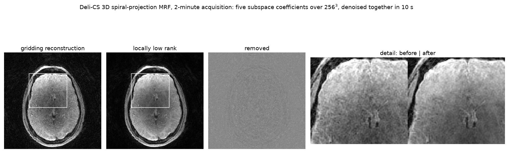

# torchdenoise

Classical denoisers for MRI: DeepInverse's, wrapped so that complex data and
stacks of slices, contrasts and frames go straight in, plus a locally low-rank
denoiser that uses the correlation between them.

[](https://github.com/FiRMLAB-Pisa/torchdenoise/actions/workflows/test-ci.yml)
[](https://codecov.io/gh/FiRMLAB-Pisa/torchdenoise)
[](LICENSE)

A denoiser written for natural images takes a real `(batch, channel, height,
width)` tensor. MRI gives complex volumes with any number of axes in front of
the spatial ones — slices, contrasts, echoes, dynamic frames, repetitions — and
a *spatial* denoiser has nothing to say about those axes. It must treat each
independently rather than mistake one for a spatial dimension. That is what
these wrappers add, and all they add.

- **Every leading axis is independent** — slice and time are the same case, so
  neither needs an argument to say which it is. There is a test that a stack
  denoises exactly as its entries do one at a time
- **Complex data goes straight in** — wavelets use DeepInverse's own complex
  transform, which thresholds a coefficient's magnitude and so keeps it whole;
  the denoisers that cannot take complex at all are lifted by DeepInverse's
  `ComplexDenoiserWrapper`. Which route a denoiser takes is stated, because the
  two differ by about a fifth of the signal amplitude
- **A 3D denoiser refuses a plane** rather than silently transforming the wrong
  axes, which is what happens otherwise
- **No memory between calls** — DeepInverse's variation denoisers keep their
  iterates and restart only when the shape changes, so the same input denoises
  differently depending on what preceded it. Inside an iterative reconstruction
  that is a memory nobody asked for; it is reset per call, and `warm_start`
  opts back in

The locally low-rank denoiser is the opposite case: it is the correlation
*between* contrasts that it uses. Within a small spatial block the signal
across contrasts is nearly the same curve scaled, so the block's matrix is
close to low rank while noise is not, and shrinking its singular values removes
what does not fit that description. Blocks overlap and the grid shifts between
calls, because without one or the other the block edges show as a lattice.



The five subspace coefficients of a 256³ volume — 0.62 GiB, acquired in two
minutes — denoised *together* in 2.4 s on a laptop GPU, with the data staying on
the host. The coefficients are the low-rank axis: within each block the denoiser
sees one matrix with a row per coefficient, so what it removes is what does not
fit a few curves shared across them. Each coefficient carries its own contrast,
which is why they are shown separately rather than combined into one image. The
data is not in this repository; the figure is.

## Quick Start

```bash
pip install torchdenoise
```

```python
import torch
from torchdenoise import TV, Wavelet

volume = torch.rand(8, 20, 256, 256, dtype=torch.complex64)  # frames, slices, y, x

Wavelet()(volume, sigma=0.05)                  # per slice and frame
Wavelet(spatial_dims=3)(volume, sigma=0.05)    # per frame, coupling slices
TV(iterations=50)(volume, sigma=0.05)          # complex through the adapter

from torchdenoise import LLR

series = torch.rand(5, 64, 256, 256)           # coefficients, slices, y, x
LLR(spatial_dims=2, block_size=8)(series, sigma=0.05)
LLR(spatial_dims=3, block_size=8, stride=4)(series, sigma=0.05)  # overlapping
```

## Examples

| | | |
|---|---|---|
| [`denoising.ipynb`](examples/denoising.ipynb) | complex data and stacks, 2D against 3D, and what the contrast axis buys | [](https://colab.research.google.com/github/FiRMLAB-Pisa/torchdenoise/blob/main/examples/denoising.ipynb) |

## Related Works

- **DeepInverse** — <https://deepinv.github.io/>. Every classical denoiser here
  is theirs; this package supplies the shapes and dtypes.
- **BART** — <https://mrirecon.github.io/bart/>, whose locally low-rank
  regularisation is the reference for ours.
- Trzasko J, Manduca A. *Local versus global low-rank promotion in dynamic MRI
  series reconstruction.* Proc ISMRM 2011;19:4371.
